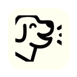

<p align="center">
  
</p>

# mungmung

A native macOS app that manages stateful notifications via CLI. Built from scratch with Swift and `UNUserNotificationCenter` — no terminal-notifier dependency.

**CLI command:** `mung`

## Why

- Full control over notification appearance (icons, action buttons, sound)
- Reliable click handling via `UNUserNotificationCenterDelegate`
- Every notification backed by a JSON state file — dismissible from notification click, sketchybar, or CLI
- No daemon or background process — launches on demand, does work, exits

## Install

```bash
brew install --cask choru-k/tap/mungmung
```

The `mung` CLI is symlinked automatically.

## Usage

```
mung add     --title "..." --message "..." [--on-click "cmd"] [--icon "..."] [--tag "name" ...]
             [--source "..."] [--session "..."] [--kind "..."] [--dedupe-key "..."] [--sound "default"]
             # --icon accepts emoji ("🤖"), SF Symbol ("bell.fill"), or image path ("/path/to/icon.png")
mung list    [--json] [--tag "name" ...] [--source "..."] [--session "..."] [--kind "..."] [--dedupe-key "..."]
mung done    <id> [--run]
mung count   [--tag "name" ...] [--source "..."] [--session "..."] [--kind "..."] [--dedupe-key "..."]
mung clear   [--tag "name" ...] [--source "..."] [--session "..."] [--kind "..."] [--dedupe-key "..."]
mung doctor  [--json]
mung version
mung help
```

## Roadmap: Agent metadata contract (v1)

Mung's main use case is agent notifications (Pi/Claude first, extensible to others).
To make that stable, v1 defines first-class metadata flags for agent workflows.

> Status: implemented in CLI/model/store. Planning artifacts live in `plan/mung-notify-platform/phase-1/`.

```bash
mung add   ... [--source "..."] [--session "..."] [--kind "..."] [--dedupe-key "..."] [--tag "..." ...]
mung list  ... [--source "..."] [--session "..."] [--kind "..."] [--dedupe-key "..."]
mung count ... [--source "..."] [--session "..."] [--kind "..."] [--dedupe-key "..."]
mung clear ... [--source "..."] [--session "..."] [--kind "..."] [--dedupe-key "..."]
```

| Flag | Purpose | Example |
|------|---------|---------|
| `--source` | Adapter/source identity | `pi-agent`, `claude` |
| `--session` | Session/run correlation key | `01HT...` |
| `--kind` | Alert class (adapter-defined) | `update`, `action` |
| `--dedupe-key` | Replace previous matching alert before adding | `pi:update:$PI_SESSION_ID` |

Contract rules:
- Agent adapters should set `source`, `session`, and `kind`.
- `--tag` remains available as optional custom labels.
- Metadata and tag filters use OR within one dimension and AND across dimensions.
- `--dedupe-key` replacement is scoped by `--session` when session is provided; otherwise it applies globally to that key.

### Agent examples (v1 contract)

```bash
# Pi agent update
mung add --title "Pi task update" --message "Pi finished this turn" \
  --source pi-agent --session "$PI_SESSION_ID" --kind update \
  --icon "🦴" --sound default

# Replace previous session update (dedupe)
mung add --title "Pi task update" --message "New summary" \
  --source pi-agent --session "$PI_SESSION_ID" --kind update \
  --dedupe-key "pi:update:$PI_SESSION_ID" \
  --icon "🦴" --sound default

# Claude confirmation-needed alert
mung add --title "Need confirmation" --message "Waiting for your choice" \
  --source claude --session "$CLAUDE_SESSION_ID" --kind action \
  --icon "🤖" --sound default

# Session-scoped cleanup
mung clear --source pi-agent --session "$PI_SESSION_ID"
```

## Integrations + Extensibility Kit

### Adapter contract (recommended baseline)

For agent adapters, treat these as the baseline contract for `mung add`:

| Category | Flags | Notes |
|---|---|---|
| Required | `--title`, `--message`, `--source`, `--session`, `--kind` | Stable identity + routing + filtering |
| Strongly recommended | `--dedupe-key` | Prevents duplicate spam in long-running turns |
| Optional | `--on-click`, `--icon`, `--sound`, `--tag` | UX and custom grouping |

### Lifecycle reference (Pi/Claude)

| Adapter lifecycle event | Recommended mung operation |
|---|---|
| Session/agent start | `mung clear --source <adapter> --session <id>` |
| Agent update/end | `mung add ... --kind update --dedupe-key "<adapter>:update:<id>"` |
| Confirmation required | `mung add ... --kind action --dedupe-key "<adapter>:action:<id>"` |
| Confirmation resolved | `mung clear --source <adapter> --session <id> --kind action` |
| Session shutdown | `mung clear --source <adapter> --session <id>` |

### Adapter upgrade checklist

If your integration currently emits only tags:

1. Add metadata fields to `mung add`: `--source`, `--session`, `--kind`.
2. Add stable dedupe keys for update/action lanes.
3. Move cleanup paths to metadata filters (`mung clear --source ... --session ...`).
4. Keep tags only for extra labels/UI-specific grouping.

### Focus behavior matrix (mung-notify reference)

This matrix documents the current `mung-notify` focus behavior (the `on_click` script), not a core mung guarantee.

| Runtime combination | Focus tier | Notes |
|---|---|---|
| WezTerm | exact | Pane-targeted activation via WezTerm pane ID |
| WezTerm + tmux | exact | WezTerm pane focus + tmux session/window/pane |
| WezTerm + zellij | exact | WezTerm pane focus + zellij tab/pane |
| Ghostty | app_only | Brings Ghostty frontmost only |
| Ghostty (single tab) + tmux | practical_exact | Deterministic if single-tab invariant holds |
| Ghostty (single tab) + zellij | practical_exact | Deterministic if single-tab invariant holds |
| Ghostty (multi tab) + tmux | best_effort | tmux target respected; originating Ghostty tab not guaranteed |
| Ghostty (multi tab) + zellij | best_effort | zellij target respected; originating Ghostty tab not guaranteed |

## Examples

```bash
# Simple notification
mung add --title "Build" --message "Deploy ready" --on-click "open https://github.com"

# Notification with tags and icon
mung add --title "Claude Code" --message "Waiting for input" \
  --tag claude --icon "🤖" --sound default \
  --on-click "aerospace workspace Terminal"

# List all pending alerts
mung list
mung list --json

# Get count (useful for sketchybar)
mung count

# Dismiss an alert
mung done 1738000000_a1b2c3d4

# Dismiss and run its on-click action
mung done 1738000000_a1b2c3d4 --run

# Clear all alerts with a tag
mung clear --tag claude
```

## Menu Bar App

When launched as a GUI app (e.g. from `/Applications`), mungmung lives in the macOS menu bar.

- **Menu bar icon** — a custom dog silhouette that adapts to light/dark mode, with a red dot badge when alerts are present
- **Alert popup** — scrollable list of pending alerts, each showing icon, title, message, and age. A **Run** button (play icon) fires the alert's `on-click` command; a dismiss button removes it. **Clear All** at the bottom removes every alert at once.
- **Settings** — Launch at Login toggle, Polling Interval picker (1s / 2s / 5s / 10s), and Notification Sound toggle
- **Quit MungMung** — in the popup footer

## How it works

1. `mung add` writes a JSON state file to `~/.local/share/mung/alerts/` and fires a native macOS notification
2. When user clicks the notification, macOS relaunches the app — it executes dismissal through the same `Commands.done(..., run: ...)` path used by CLI
3. After any state change, the app triggers `sketchybar --trigger mung_alert_change` so sketchybar plugins can update

State directory is configurable via `$MUNG_DIR` (defaults to `~/.local/share/mung`).

### on_click execution context

`on_click` commands run in a shell context resolved in this order:

1. `$MUNG_ON_CLICK_SHELL` (if executable)
2. `$SHELL` (if executable)
3. fallback `/bin/sh`

Additional controls:
- `$MUNG_ON_CLICK_CWD` — set working directory for action execution (must exist)
- `$MUNG_DEBUG_ACTIONS=1` — emit action/sketchybar execution failures to stderr for troubleshooting
- `$MUNG_DEBUG_LIFECYCLE=1` — emit lifecycle logs for `add` / `done` / `clear`

## Diagnostics + release hardening

Use `doctor` to inspect runtime assumptions without source edits:

```bash
mung doctor
mung doctor --json
```

`doctor` reports executable/bundle context, notification availability, state paths/counts,
and resolved action shell context.

For release verification, run:

```bash
make verify-release
```

## Sketchybar integration

The app doesn't include a sketchybar plugin — it just triggers the `mung_alert_change` event. Your sketchybar config subscribes to that event and reads state files to render alert items. See `examples/sketchybar-plugin.sh` for a reference implementation.

## Spec

See [SPEC.md](SPEC.md) for the full technical specification.

## License

MIT
